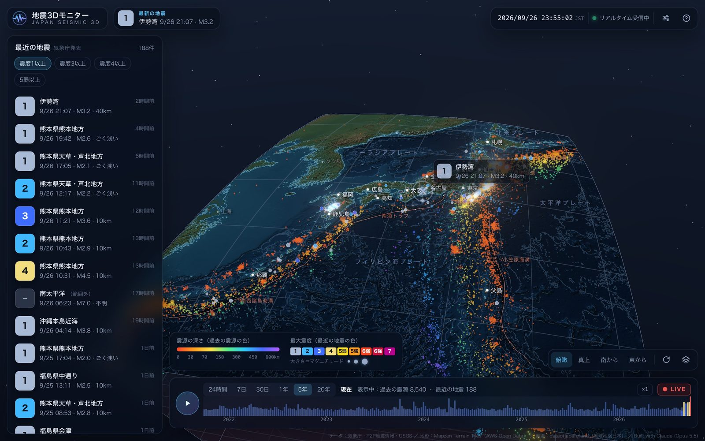
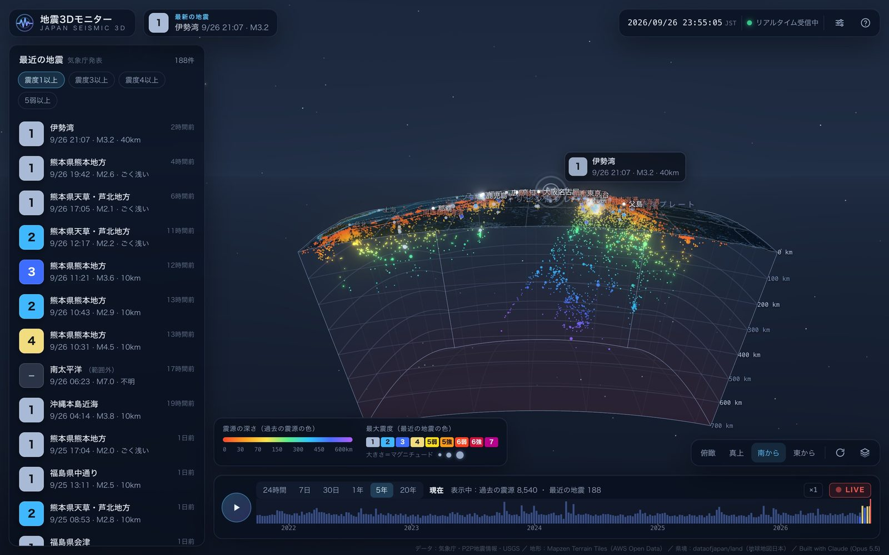
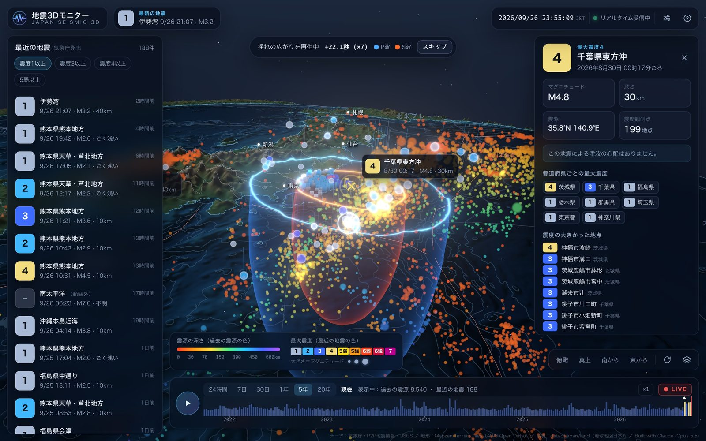
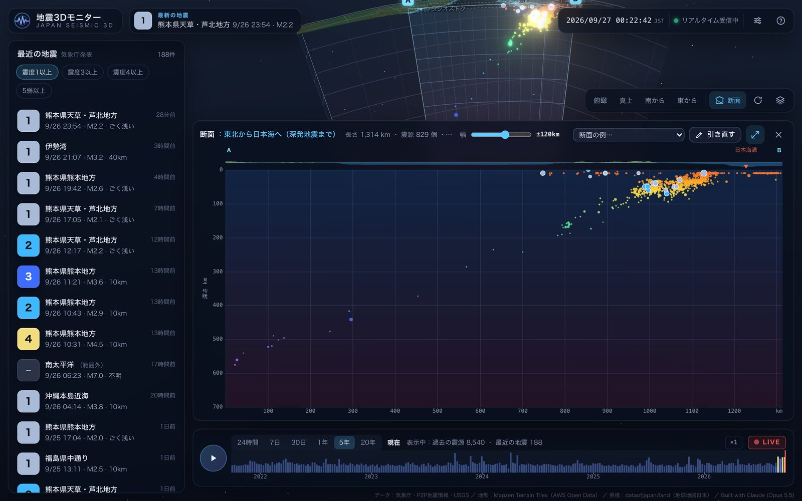
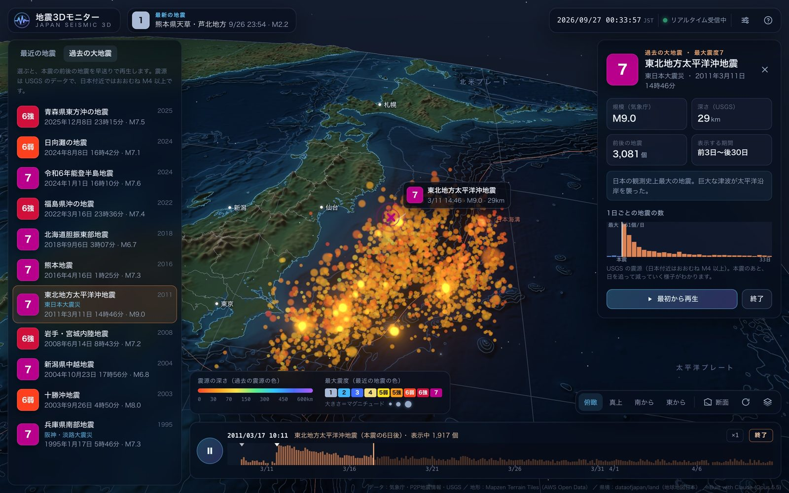
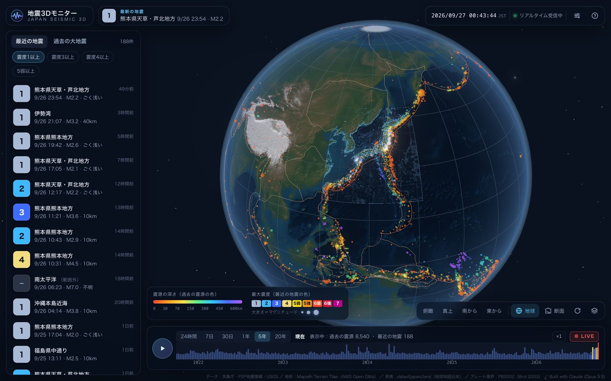
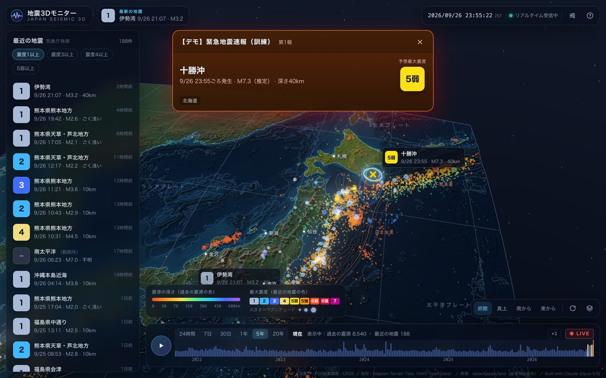
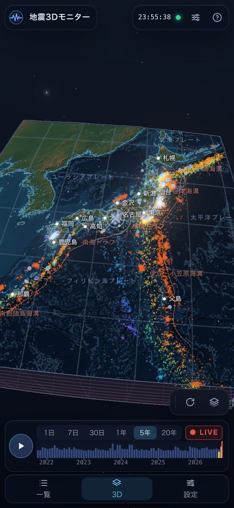

# 地震3Dモニター JAPAN SEISMIC 3D

日本周辺の地震を、地形・海底地形と一緒に立体で見るリアルタイム地震モニターです。
地下の震源を実際の深さの位置に置いて表示するので、日本列島の下へ沈み込むプレートの形が、震源の分布として浮かび上がります。
地震を選ぶと、P波・S波が広がり、各地の震度観測点が揺れていく様子を再生します。
Three.js で作った `index.html` 1ファイルだけで動き、地形や地震のデータはブラウザが表示するときに取得します。
開発には AI コーディングツールの [Claude Code](https://claude.com/claude-code)（モデル：Claude Opus 5.5、effort：Max）を使いました。

**▶ ブラウザで開く：[https://tanuu5.github.io/earthquake-monitor-3d/](https://tanuu5.github.io/earthquake-monitor-3d/)**
（インストール不要。PC・スマホ・タブレットのブラウザで動きます）













## できること

- **地形と海底地形の立体表示**：日本周辺（北緯20〜48度、東経120〜151.5度）を、地球の丸みのまま切り出して表示します。近づくと、その場所の細かい地形を追加で読み込みます。海溝・トラフ（プレート境界）は、海底地形の最も深いところをたどって描いています。
- **地下の震源**：USGS の震源データ（過去5年、M4以上）を実際の深さに置いています。「南から」「東から」の視点で横から見ると、沈み込むプレートに沿った震源の帯（和達－ベニオフ帯）がわかります。表示期間を「20年」にすると、2006年以降のM5以上の地震も表示します。
- **最近の地震**：気象庁が発表した約1か月分の地震を、最大震度の色で表示します。一覧から選ぶこともできます。
- **揺れの広がりの再生**：地震を選ぶと震源へ移動し、P波（青）とS波（橙）が地表と地下へ広がる様子を早送りで再生します。S波が届いた順に、各地の震度観測点が震度の色と高さの柱で立ち上がり、都道府県も最大震度の色で塗り分けます。
- **地球儀**：大きくズームアウトする（または「地球」ボタン）と地球全体になり、世界の地震（過去5年の M5.5 以上と、過去30日の M4.5 以上）とプレート境界を表示します。地震をクリックすると揺れの広がりを表示し、日本に近づくと元の詳しい表示に戻ります。
- **過去の大地震**：東日本大震災・能登半島地震・熊本地震・阪神・淡路大震災など11の地震を選ぶと、本震の前後の地震（USGS の震源）を早送りで再生します。本震（熊本地震は前震も）の時刻で一時停止して揺れの広がりを見せ、1日ごとの地震の数のグラフで余震の減り方も確認できます。
- **断面**：地図上の2点をクリックすると、その線に沿って地下を切った断面を表示します。断面の近く（±10〜200km）の震源だけを残してカメラ側の地面を切り取り、画面下には横軸が距離・縦軸が深さの断面図を出します。「東北から日本海へ」「伊豆・小笠原を東西に」などの例も選べます。
- **タイムライン**：表示期間（24時間・7日・30日・1年・5年・20年）を切り替えられます。▶で地震活動を早送り再生し、バーをドラッグすると好きな時点の状態を表示します。
- **共有リンク**：右上の共有ボタンで、いま見ている表示（選んだ地震・断面・過去の大地震・地球儀・視点）をリンクにしてコピーします。リンクを開くと同じ表示から始まります。
- **リアルタイム受信**：P2P地震情報の WebSocket API で地震情報を受け取り、通知音やブラウザの通知でお知らせします。操作していないときは、新しい地震の震源へ自動で視点を移します。
- **緊急地震速報**：受信すると画面上部に警報を出し、P波・S波の広がりを実際の時間の速さで表示します。「自分の地点」を設定しておくと、揺れ（S波）が届くまでの目安の秒数を表示します。設定画面から架空の地震で表示を確かめる「デモ」も再生できます。





## 操作方法

| 操作 | マウス・キーボード | タッチ |
| --- | --- | --- |
| 回転 | 左ドラッグ | 1本指でドラッグ |
| 移動 | 右ドラッグ | 2本指でドラッグ |
| ズーム | ホイール | ピンチ |
| 地震を選ぶ（揺れを再生） | 点または一覧をクリック | 点または一覧をタップ |
| タイムラインの再生／停止 | Space | ▶ボタン |
| 視点（俯瞰・真上・南から・東から） | 1〜4 | 右下のボタン |
| 断面を引く（2点をクリック） | S、または「断面」ボタン | 「断面」ボタン → 2点をタップ |
| 地球儀にする／日本に戻る | G、または大きくズームアウト／日本に近づく | 「地球」ボタン、またはピンチ |
| 視点を初期位置に戻す | R | 「俯瞰」ボタン |
| パネルを閉じる | Esc | ×ボタン |

右下の「表示の設定」から、表示するものの切り替え、深さの強調（×1〜×5）、地形の起伏の強調（×1〜×30）を変更できます。
右上の「設定」では、通知音・デスクトップ通知・自分の地点・緊急地震速報のデモを設定できます。設定はブラウザの中にだけ保存されます。

## 表示されているもの

| 表示 | 意味 |
| --- | --- |
| 小さな点 | 過去の震源（USGS）。色は深さ（赤：浅い → 黄・緑・青 → 紫：約600km）、大きさはマグニチュード |
| 縁取りのある大きな点 | 気象庁が発表した最近の地震。色は最大震度、大きさはマグニチュード。24時間以内の地震は波紋が広がります |
| 赤い線 | 海溝・トラフ（プレート境界） |
| 地下の壁の目盛り | 深さ100kmごとの目盛り。深さはわかりやすいように2倍に強調しています（変更できます） |
| 柱 | 選んだ地震の各地の震度（気象庁の震度観測点） |
| 青い輪・橙の輪 | P波・S波が地表に届いている位置。揺れの伝わる速さは P波 毎秒7km、S波 毎秒4km の目安です |

## データの出典

| データ | 提供元 | 用途 |
| --- | --- | --- |
| 地震情報・震度観測点 | [気象庁](https://www.jma.go.jp/)（防災情報 JSON） | 最近の地震、各地の震度 |
| リアルタイム配信・緊急地震速報 | [P2P地震情報](https://www.p2pquake.net/)（JSON API v2 / WebSocket API） | 新しい地震の受信 |
| 過去の震源 | [USGS Earthquake Catalog](https://earthquake.usgs.gov/fdsnws/event/1/) | 地下の震源の分布、過去の大地震の前後の地震 |
| 標高・海底地形 | Mapzen Terrain Tiles（[AWS Open Data](https://registry.opendata.aws/terrain-tiles/)。SRTM、GMTED2010、ETOPO1 ほか） | 地形の立体表示 |
| 都道府県の境界 | [dataofjapan/land](https://github.com/dataofjapan/land)（出典：地球地図日本） | 県境、県ごとの震度の塗り分け |
| 世界のプレート境界 | Peter Bird (2003) PB2002（[Hugo Ahlenius / Nordpil による変換](https://github.com/fraxen/tectonicplates)、ODC-By 1.0） | 地球儀のプレート境界 |

データはすべて表示するときに各提供元から取得しています。このリポジトリにはデータを含めていません。

## ご注意

- このツールは防災の参考情報です。緊急地震速報の表示は遅れたり、届かなかったりすることがあります。身を守る行動は、気象庁や自治体の発表、テレビ・ラジオ・スマートフォンの緊急速報に従ってください。
- 揺れが届くまでの秒数は、単純な速度による目安です。
- P2P地震情報の WebSocket API は、1つの IP アドレスから同時に2接続までという制限があります。同じブラウザで複数のタブを開いても、接続は1本だけを使い、受信した情報をタブ同士で共有します。
- 通知音は、ブラウザの仕様により、ページを一度クリック（タップ）するまで鳴りません。

## 動作環境

- WebGL2 に対応したブラウザ（Chrome / Edge / Firefox / Safari の最新版）
- スマホなど画面の小さい端末では、読み込む地形の細かさを1段階下げて軽くしています

## 開発

ビルドは不要です。`index.html` をローカルの Web サーバーで配信して開きます。

```bash
python3 -m http.server 8765
```

ブラウザで `http://localhost:8765/` を開きます。

- URL に `?sandbox` を付けると、P2P地震情報の試験配信（過去の情報を約30秒ごとに再送）に接続します。
- ブラウザのコンソールから `window.quake3d` で内部の状態を確認できます（例：`quake3d.runDemo()` で緊急地震速報のデモ）。
- 共有リンクは URL の `#` 以降に表示の状態を入れています。

| パラメータ | 内容 | 例 |
| --- | --- | --- |
| `eq` | 気象庁の地震（EventID） | `#eq=20260926103120` |
| `arc` | 過去の大地震 | `#arc=tohoku2011` |
| `sec` | 断面（始点の緯度,経度,終点の緯度,経度,幅km） | `#sec=39.3,137,39.3,145.3,50` |
| `globe`, `gcam`, `geq` | 地球儀、視点（緯度,経度,地球の中心からの距離km）、世界の地震（USGS の ID） | `#globe=1&gcam=-15,-75,22000` |
| `cam` | 視点（注視点の緯度,経度,高さkm,距離km,俯角,方位） | `#cam=36.5,138.3,-40,900,40,-30` |
| `r` | 表示期間（`1d` `7d` `30d` `1y` `5y` `20y`） | `#r=30d` |

## 技術的なしくみ

- **座標**：地球を半径6371kmの球として扱い、緯度・経度・深さを地球中心の座標から日本付近を原点にしたローカル座標（1単位＝1km）へ変換しています。切り出した範囲は、地球の丸みのまま湾曲しています。
- **地形**：Terrarium 形式の標高タイル（PC はズームレベル6、約2km／画素）をつなぎ合わせて半精度の浮動小数点テクスチャに入れ、頂点シェーダで起伏をつけています。陰影と標高の色は読み込み時に一度だけ計算して焼き込みます。海岸線・等深線・経緯線はフラグメントシェーダで描いています。近づくと、見ている場所のまわりだけズームレベル8〜9（約0.5〜0.25km／画素）のタイルを追加で読み込み、境目をぼかして重ねます。
- **震源**：USGS の FDSN API から1年ごとに並列で取得し、位置は GPU で計算しています。地表に隠れた震源は、深度比較を反転した2回目の描画で少し暗く「透かして」表示します。
- **断面**：2点を通る大円（地球の中心を通る面）からの距離と、面に沿った角度で震源を選んでいます。この計算は GPU の頂点シェーダで行い、断面の外の震源を薄くしています。カメラ側の地面・壁・線は、フラグメントシェーダで切り取っています。
- **揺れ**：地表の P波・S波の輪は、地形のシェーダで各画素と震源の距離から描いています。地下の波面は楕円体の殻として描きます。観測点の柱はインスタンス描画で、S波の到達時刻に合わせて伸びます。
- **県ごとの塗り分け**：県境データ（TopoJSON）を標高タイルと同じ座標のラスターに自前で塗りつぶし、シェーダから参照しています。
- **地球儀**：地球全体の標高タイル（ズームレベル3）を1枚にまとめて陰影を焼き込み、緯度・経度1度ごとの球に貼っています。日本付近だけは詳しい地形を見せ、地球儀のあいだは OrbitControls の回転軸を地球の自転軸に切り替えて北が上になるようにしています。
- **リアルタイム受信**：P2P地震情報の WebSocket に接続します。Web Locks API と BroadcastChannel で、複数タブのうち1つだけが接続して他のタブに中継します。
- **使用技術**：Three.js（r186）、WebGL2、Web Audio API

## ライセンス

[MIT License](LICENSE)（© 2026 たぬ）

地震情報・地形などのデータは各提供元のものです。利用条件は各提供元をご確認ください。
